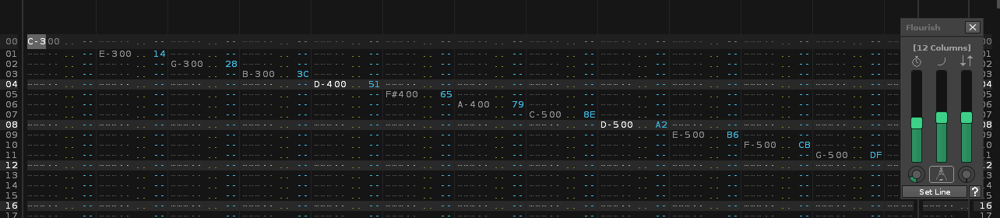
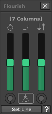
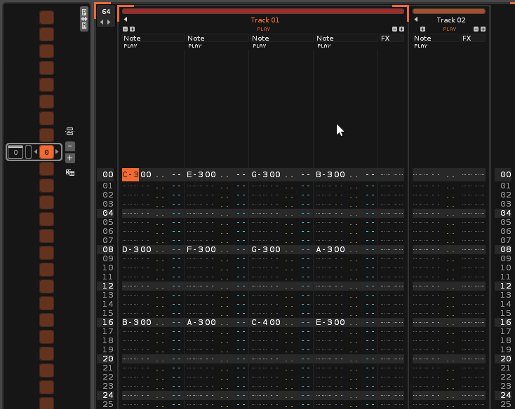
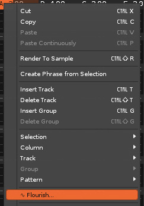
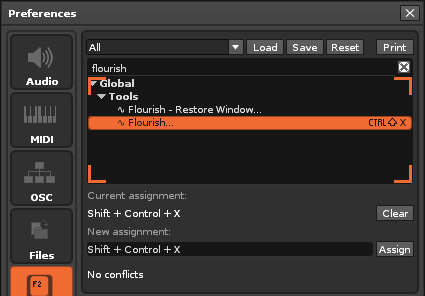
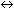
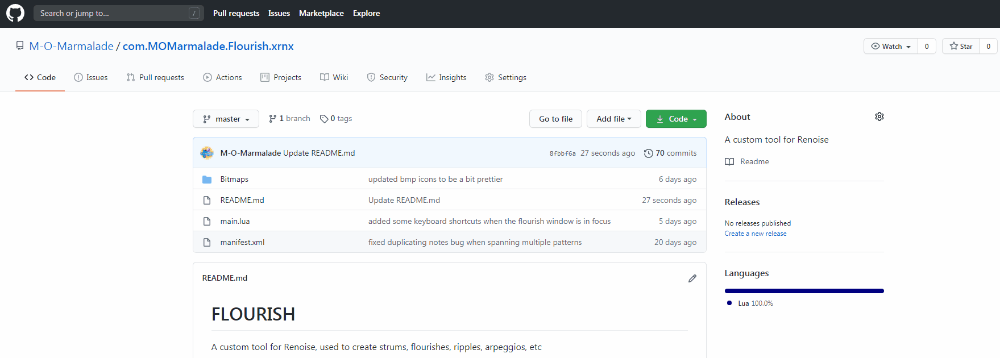
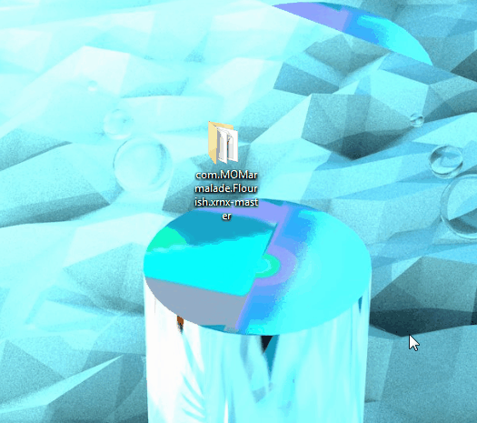
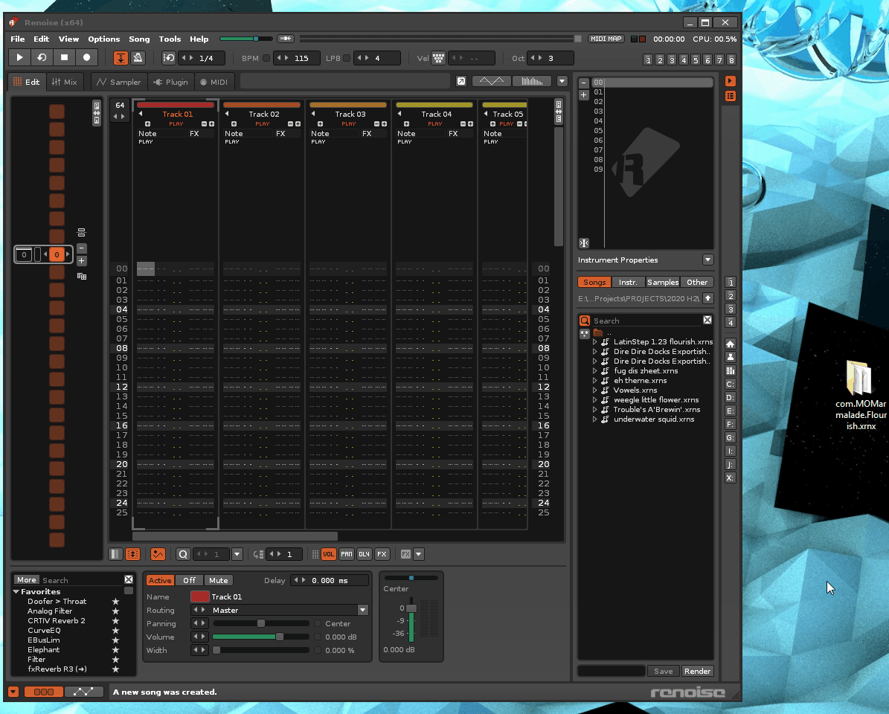

**(DEPRECATED - [Replaced with new tool!](https://github.com/M-O-Marmalade/Reform))**

A custom tool for Renoise, used to create flourishes, strums, ripples, arpeggios, etc

[OFFICIAL PAGE](https://xephyrpanda.wixsite.com/citrus64/flourish)

## Controls

+ Move the Time slider to spread the notes over time (the range of this slider can be extended by the rotary knob just below it)
+ Move the Tension slider to change the distribution of the notes
+ Move the Offset slider to shift all notes over time (the range of this slider can be extended by the rotary knob just below it)
+ Click the Non-Destructive/ button to toggle Non-Destructive Mode on/off
+ Use the "Set Line" button (or the keyboard shortcut/menu entries) to set a new line to be edited by Flourish
+ Click the Help button to view this page at any time

**Note:** The more lines/patterns your currently edited flourish spans over, the more the tool will lag.

## Activating Flourish on a Line
+ Flourish uses the pattern edit cursor's position to select a line for processing (it does not support box selection)\

+ You can use the **right-click menu** or **user-assignable keyboard shortcut** to activate Flourish on the currently edited line\
\

## Keyboard Shortcuts
While the Flourish window is in focus, there are some keyboard shortcuts supported by the tool
+ Hold the **[SPACEBAR]** to preview the currently processed flourish/chord
+ Use the **[ARROW KEYS ]** to navigate the edit cursor
+ Press **[CTRL + SHIFT + X]** to select a new line to be processed
+ Press **[CTRL + ]** to move the Time slider
+ Press **[CTRL + ]** to increase/decrease the Time multiplier knob

# HOW TO INSTALL

***Just download the [latest version](https://github.com/M-O-Marmalade/mom.MOMarmalade.Flourish.xrnx/releases/latest/) from the Releases section above!*** If you would like the latest experimental build though, you can download it by following the steps/GIFs below!

1. **Download** the tool from this repository\

2. **Extract** the *"com.MOMarmalade.Flourish.xrnx-master"* folder from the .zip file\

3. **Rename** the extracted folder to remove the *"-master"* from the end of the name\

4. **Drag and Drop** the renamed folder onto an open Renoise window to install the tool\

...and it's ready to use! (The installation files can now be deleted)
